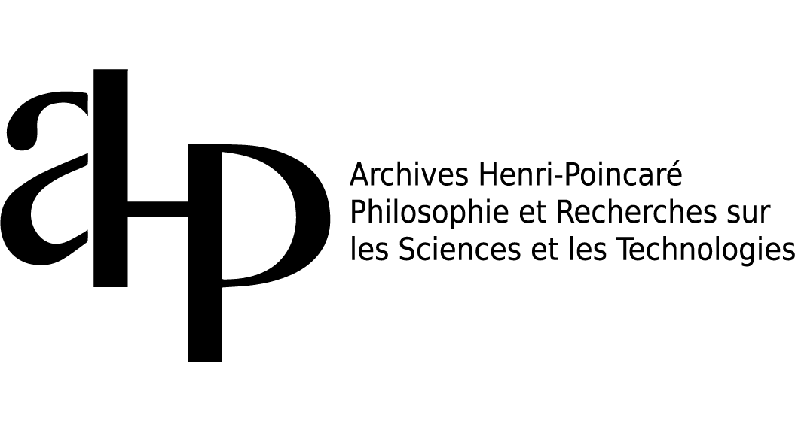
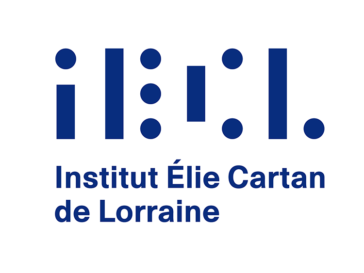
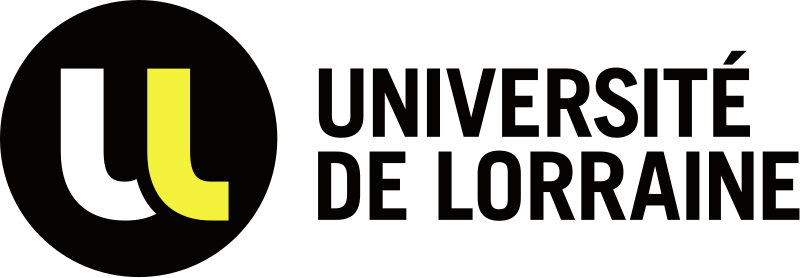

{:style="display:block; margin-left:auto; margin-right:auto" width="800"}

---

The seminar _**Reflexions**_ is a new joint seminar between the [Institut Élie Cartan de Lorraine (IECL)](https://iecl.univ-lorraine.fr/), the [Archives Henri-Poincaré (AHP)](https://poincare.univ-lorraine.fr/), and the [Lorraine Research Laboratory in Computer Science and its Applications (Loria)](https://www.loria.fr/en/) at the [Université de Lorraine](https://www.univ-lorraine.fr/).

It consists of **general-interest talks and activities** intended for a broad audience, centered on a **single yearly theme**. The theme is chosen for its common interest to members of our three institutes, and for its potential to foster exchanges of ideas and viewpoints across backgrounds.

> The theme for the **Spring 2026** is _**Proofs, rigor, and formalization**_.

In the past few years, **proof assistants** have generated intense interest and curiosity among mathematicians and philosophers. By proof assistants, we mean computer-assisted tools for the **verification of classical proofs**. What are these tools? How do they work? What are their strengths and weaknesses? What impact can they have on the practice of mathematical proofs, and on our conceptions of the notion of **rigor** in mathematics?

These and related questions will be discussed through **talks**, **practice sessions**, **discussion sessions**, and more.

We shall meet **six Friday afternoons during the first semester of 2026**. Below is the program for the **first four sessions**. The next sessions will be held **after May 15** and will be announced soon.

 
  
  
  
  
  

---

## Session 1 — IECL — _Friday, February 6, 2026_

### 13h30-14h45: Talk

**Speaker:** [Patrick Massot](https://www.imo.universite-paris-saclay.fr/~patrick.massot/) (Laboratoire de mathématique d’Orsay) 

**Title: _Pourquoi raconter des maths aux ordinateurs ?_**

**Abstract:** Dans cet exposé j’expliquerai ce que signifie « expliquer des mathématiques à un ordinateur » et pourquoi je trouve cela intéressant et utile. Je montrerai à quoi ressemble concrètement l’utilisation d’un logiciel permettant d’encoder informatiquement des définitions, énoncés et démonstrations. Je présenterai les applications de ces techniques pour vérifier, expliquer, enseigner ou créer des mathématiques. Je mentionnerai des exemples de projets non-triviaux dans ce domaine et j’évoquerai brièvement les liens avec l’IA. Il n’y a aucun pré-requis.

### 15h00-17h30: Practice Session

**Title: _Introduction à l’assistant de preuve Lean par la pratique_**

Le logiciel Lean permet de parler de maths de tout niveau à son ordinateur. Il peut aussi servir à enseigner le raisonnement mathématique rigoureux, par exemple en L1. Ce TP sera une introduction à l’utilisation de Lean en pratique. Il n’y a aucun pré-requis si ce n’est de venir avec un ordinateur portable.

**Location:** Salle de Conférence de l'IECL, Faculté des Sciences et technologie Campus, Boulevard des Aiguillettes, 54506 Vandoeuvre-lès-Nancy [plan d'accès](https://iecl.univ-lorraine.fr/plan-dacces/).

---

## Session 2 — IECL — _Friday, March 13, 2026_

### Talk

**Speaker:** [Sophie Tourret](https://members.loria.fr/sophie.tourret/) (Loria)

**Title: _L'automatisation dans les assistants de preuve_**

**Abstract:** Pour faire prouver des théorèmes à un ordinateur, il y a deux approche possible :

- la preuve interactive, où l'humain décris les théorèmes et les étapes des preuves à un assistant à la preuve, et
- la preuve automatique, où l'humain fournis simplement les théorèmes encodés sous formes de formules logique, et laisse le prouveur raisonner à sa façon.

Dans cette présentation, je vous exposerai plusieurs techniques de preuve automatique et je vous parlerai de leurs usages dans les assistants de preuve.

### Practice Session “Math in LEAN”

**Tutors:** [Vincent Trélat](https://vtrelat.github.io/) and [Ghilain Bergeron](https://github.com/Mesabloo) (Loria)

Cette session pratique se veut le prolongement de la précédente et proposera aux participants de se plonger dans l'ouvrage **_Mathematics in Lean_** de Jeremy Avigad and Patrick Massot (disponible en ligne [ici](https://leanprover-community.github.io/mathematics_in_lean/index.html)), avec l'appuie d'utilisateurs Lean expérimentés. Il vous sera aussi possible de reprendre le tutoriel de Patrick Massot si vous avez manqué la session précédente ou que vous souhaitez le finir.

**Location:** Salle de Conférence de l'IECL, Faculté des Sciences et technologie Campus, Boulevard des Aiguillettes, 54506 Vandoeuvre-lès-Nancy [plan d'accès](https://iecl.univ-lorraine.fr/plan-dacces/).

---

## Session 3 — IECL — _Friday, March 20, 2026_

### Talks

**First Speaker:** [Antoine Chambert-Loir](https://webusers.imj-prg.fr/~antoine.chambert-loir/index.xhtml) (Institut de mathématique de Jussieu – Paris Rive Gauche, Université Paris Cité)  

**Title: _Retour d'expérience en mathématiques formalisées_**

**Abstract:** Pourquoi vouloir faire des preuves formelles ? Qu'apporte l'ordinateur ? Et de quelles preuves parlerait-on ?
À partir de mon expérience des cinq dernières années, qui concerne essentiellement des questions d'algèbre, j'essayerai de présenter mes bouts de réponse à ces questions.

**Second Speaker:** [Yacin Hamami](https://www.yacinhamami.com/) (Archives Henri-Poincaré, CNRS)  

**Title: _Démonstrations, scripts, et preuves formelles :
Quels liens entre l’idéal et la pratique de la
démonstration ?_**

**Abstract:** La formalisation des mathématiques par les assistants de preuve nous confronte à trois types d'objets aux statuts distincts : les démonstrations telles qu'elles figurent dans la pratique ordinaire, adressées à des lecteurs humains qu'elles visent à convaincre et à faire comprendre ; les preuves formelles, objets logiques entièrement explicites que la machine vérifie mécaniquement mais qui restent le plus souvent illisibles pour un lecteur humain ; et entre les deux, les scripts de code rédigés dans des assistants comme Lean, Coq ou Isabelle—objets hybrides qui portent encore la marque des intentions de celui qui les écrit, tout en étant destinés à guider la machine vers une vérification formelle.

Quelle est la nature de ces trois objets, et quelles relations entretiennent-ils entre eux ? Cette question a fait l'objet de débats intenses en philosophie des mathématiques ces dernières années. Au cœur de ces débats se trouve la relation entre les démonstrations dans la pratique et l'idéal de preuve formelle, et en particulier la question de la rigueur mathématique qu'elle soulève. Doit-on concevoir la rigueur des démonstrations en pratique comme reposant, en dernière instance, sur la notion de preuve formelle—une démonstration étant rigoureuse lorsqu'elle est, en principe, formalisable ? Ou doit-on au contraire concevoir la rigueur en pratique comme relativement indépendante de cet idéal, obéissant à des normes et des standards qui lui sont propres ?

Dans cet exposé, je présenterai quelques éléments clés de ces débats ainsi que les principales réponses philosophiques qui ont été proposées.

### Practice Session “Math in LEAN”

**Tutors:** [Vincent Trélat](https://vtrelat.github.io/) and [Ghilain Bergeron](https://github.com/Mesabloo) (Loria)

Cette session pratique se veut le prolongement de la précédente et proposera aux participants de se plonger dans l'ouvrage **_Mathematics in Lean_** de Jeremy Avigad and Patrick Massot (disponible en ligne [ici](https://leanprover-community.github.io/mathematics_in_lean/index.html)), avec l'appuie d'utilisateurs Lean expérimentés. 

**Location:** Salle de Conférence de l'IECL, Faculté des Sciences et technologie Campus, Boulevard des Aiguillettes, 54506 Vandoeuvre-lès-Nancy [plan d'accès](https://iecl.univ-lorraine.fr/plan-dacces/).

---

## Session 4 — Archives Henri Poincaré — _Friday, April 3, 2026_

### 14h00-16h30: Talks

**First Speaker:** [Baptiste Mélès](http://baptiste.meles.free.fr/) (Archives Henri-Poincaré, CNRS) 

**Title:_La linguistique des assistants à la démonstration_**

**Abstract:** La linguistique ne semble rien avoir à nous apprendre sur les démonstrations formelles des assistants à la démonstration : ne connaît-on pas d'entrée de jeu en toute transparence tous les constituants de ce langage — à savoir son alphabet, son lexique, sa syntaxe et sa sémantique ? L'approche linguistique nous permettra pourtant de révéler quelques constituants cachés de ces langages formels : on distinguera dans l'alphabet une graphétique et une graphématique, on montrera la structuration différentielle du lexique, on étudiera la morphologie sous la syntaxe, et on mettra au jour la pragmatique qui recouvre la sémantique : autant de caractéristiques qui rapprochent ces langages formels des langues humaines.

**Second Speaker:** [Philippe de Groote](https://members.loria.fr/PdeGroote/) (Loria)

**Title: _Discours et démonstrations_**

**Abstract:** Dans cet exposé, nous nous pencherons sur la structure linguistique des « mathématiques naturelles », c'est-à-dire les mathématiques telles qu'exprimées par les mathématiciens et mathématiciennes dans leurs écrits scientifiques. Nous nous pencherons plus particulièrement sur le cas des démonstrations mathématiques et expliquerons pourquoi celles-ci doivent être considérées comme des discours. Nous montrerons à l'aide de quelques exemples comment l'étude de la structure discursive des démonstrations peut suggérer de nouvelles manières de formaliser celles-ci.

### 16h30-17h30: Discussion générale

**Location:** salle de réunion 2 au rez-de-chaussée du bâtiment des Archives Henri Poincaré, 91 avenue de la Libération, 54001 Nancy [plan d'accès](https://poincare.univ-lorraine.fr/fr/contact-et-acces). Lorsque vous entrez dans le bâtiment, traversez le hall principal ; la salle se situe au fond du couloir sur la gauche.

---

## Session 5 — TBA - _TBA_

---

## Session 6 — TBA - _TBA_

---

# Participation

The seminar is **open to everyone** (students, PhD candidates, researchers, colleagues from neighboring disciplines, etc.).

# Contact

For any question, please write to the organizers.

# Organizers

- [Yacin Hamami](https://www.yacinhamami.com/) (AHP)
- [Alexandre Afgoustidis](https://afgoustidis.perso.math.cnrs.fr/) (IECL)
- [Alain Genestier](https://iecl.univ-lorraine.fr/membre-iecl/genestier-alain/) (IECL)
- [Sophie Tourret](https://members.loria.fr/sophie.tourret/) (Loria)

# Acknowledgement and Support

_**Reflexions**_ is funded by the [Institut Élie Cartan de Lorraine (IECL)](https://iecl.univ-lorraine.fr/), the [Archives Henri-Poincaré (AHP)](https://poincare.univ-lorraine.fr/), and the [Lorraine Research Laboratory in Computer Science and its Applications (Loria)](https://www.loria.fr/en/).

  
  
  
  
  

